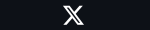
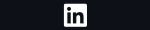
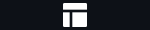
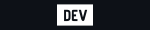
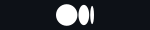

 

## icons 
* X
* LinkedIn 
* Portfolio
* Dev.to
* Medium

* Adding image
* Sheild IO cards 
* Description 
* some notable projects 
* Links 

https://github-readme-streak-stats.herokuapp.com/?user=najmulhc&theme=react&hide_border=true&background=0D1117&stroke=155eef&fire=155eef&sideLabels=00F0FF&currStreakNum=FF1CF7&ring=FF1CF7&currStreakLabel=FF1CF7&sideNums=00F0FF